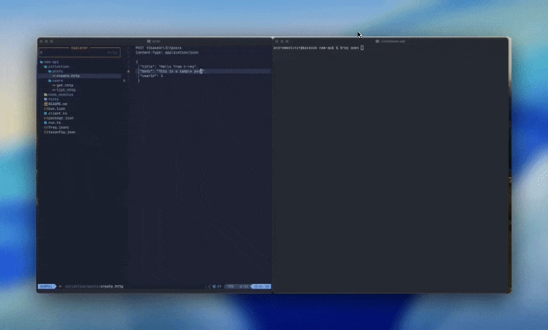
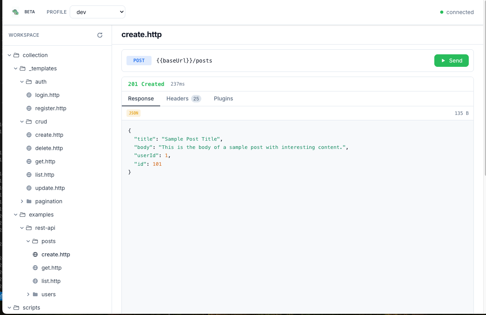

<p align="center">
  <a href="https://t-req.io"></a>
</p>

<h3 align="center">The Programmable API Engine</h3>

<p align="center">
Define requests in <code>.http</code> files. Execute from anywhere — terminal, server, SDK, or AI agent.<br/>Observe everything in real-time.
</p>

<p align="center">
  <a href="https://opensource.org/licenses/MIT"></a>
  <a href="https://github.com/tensorix-labs/t-req/actions/workflows/ci.yml"></a>
  <a href="https://discord.gg/sKY4M3eS"></a>
</p>

<p align="center">
  <b><a href="https://t-req.io">Docs</a></b> &middot; <b><a href="https://discord.gg/sKY4M3eS">Discord</a></b>
</p>

<p align="center">
  
</p>

## Install

```bash
curl -fsSL https://t-req.io/install | bash
```

Or as a library:

```bash
npm install @t-req/core
```

## Why t-req?

Most API tools couple the request format to a specific app — you're stuck in that GUI or that CLI. t-req keeps `.http` files as the source of truth but lets you run them from anywhere: a TUI, a web dashboard, a REST server, or your own code via `@t-req/core`. Add plugins to hook into the request lifecycle, write custom resolvers for dynamic values, or build entirely new tools on the engine.

## What Makes It Different

### Server Mode — Any Language, Zero SDKs

`treq serve` exposes a full REST API. Call it from Python, Go, Ruby — anything that can POST JSON.

```bash
treq serve

curl -X POST http://localhost:4097/execute \
  -H "Content-Type: application/json" \
  -d '{"content": "GET https://api.example.com/users\nAuthorization: Bearer {{token}}"}'
```

### Portable Engine — Build On Top

`@t-req/core` is a standalone library. Parse, execute, and inspect requests from your own code.

```typescript
import { createClient } from '@t-req/core';

const client = createClient({
  variables: { token: process.env.API_TOKEN },
});

const response = await client.run('./auth/login.http');
const { user } = await response.json();
```

### Plugin Pipeline — 6 Lifecycle Hooks

Intercept and transform at every stage of the request lifecycle.

```
parse.after → request.before → request.compiled → request.after → response.after
                                                                         ↓
                                                                       error
```

Use cases: AWS SigV4 signing at `request.compiled`, OAuth token refresh at `response.after`, request logging at `request.after`.

### Native SSE Streaming

First-class Server-Sent Events support with a single directive.

```http
# @name stream-events
# @sse
GET https://api.example.com/events
Accept: text/event-stream
```

## Quick Start

**TUI workflow** — explore and execute interactively:

```bash
treq init my-api && cd my-api
treq open            # TUI
treq open --web      # TUI + web dashboard
```

**Server workflow** — use from any language:

```bash
treq serve
# POST requests to http://localhost:4097/execute
```

**Library workflow** — embed in TypeScript/Node:

```typescript
import { createClient } from '@t-req/core';

const client = createClient({ variables: { env: 'staging' } });
const res = await client.run('./health-check.http');
```

## Features

- **Standard `.http` files** — VS Code REST Client and JetBrains compatible
- **Variable interpolation** with profiles and nested access (`{{user.email}}`)
- **Command resolvers** — `{{$timestamp()}}`, `{{$uuid()}}`, or your own custom functions
- **Cookie management** — automatic jar with RFC 6265 compliance
- **Web dashboard** — `treq open --web` for a browser-based UI
- **Observer mode** — see HTTP requests from external scripts in real-time
- **TypeScript-first** — full type definitions, async/await, `AsyncDisposable` support

<p align="center">
  
</p>

## Packages

| Package | Description |
|---------|-------------|
| [@t-req/core](./packages/core) | HTTP parsing and execution engine |
| [@t-req/app](./packages/app) | CLI, TUI, and server |
| [@t-req/web](./packages/web) | Browser dashboard |

## Contributing

See [CONTRIBUTING.md](./CONTRIBUTING.md) for development setup and guidelines.

## License

[MIT](./LICENSE)
