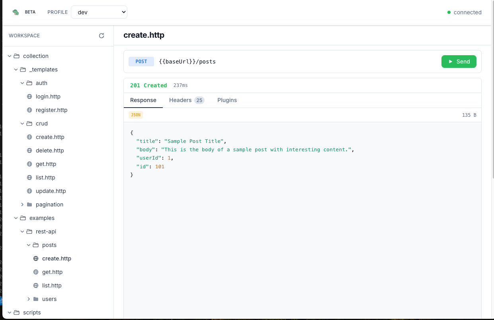

<p align="center">
  <a href="https://t-req.io"></a>
</p>

<h3 align="center">API testing that lives in your code</h3>

<p align="center">
Tired of API tools that lock your requests in proprietary formats and GUI-only workflows?<br/>
t-req keeps standard <code>.http</code> files as the source of truth and lets you run them from anywhere — terminal, server, IDE, or your own code.
</p>

<p align="center">
  <a href="https://opensource.org/licenses/MIT"></a>
  <a href="https://github.com/tensorix-labs/t-req/actions/workflows/ci.yml"></a>
  
</p>


## Install

```bash
curl -fsSL https://t-req.io/install | bash
```

Or as a library:

```bash
npm install @t-req/core
```

## Why t-req?

`.http` is the only request format supported by multiple independent editors — VS Code REST Client, JetBrains HTTP Client, and others. It's just raw HTTP: no DSL, no vendor syntax. Your files work without t-req.

But a file format alone doesn't get you far. t-req is the engine that makes `.http` files composable: hook into the request lifecycle with plugins, expose your collection as an API with `treq serve`, embed execution in your own code with `@t-req/core`, observe traffic in real time from the TUI.

One source of truth, many surfaces. The same `.http` file runs from the terminal, a server, a test suite, or a TypeScript script.

## Run from CLI

Use direct CLI commands in any terminal:

```bash
treq init my-api && cd my-api
treq run requests/users/list.http   # single request from CLI
```

## Run from the terminal 

Use the interactive terminal app to browse files, run requests, and inspect results:

```bash
treq open
```


## Run from VS Code or Cursor

Install the [t-req extension](./packages/vscode) in VS Code or Cursor for syntax highlighting, inline execution, and assertion results (`@t-req/plugin-assert`) directly in your editor.

[Watch VS Code/Cursor demo (MP4)](./docs/assets/treq-init-cursor.mp4)

## Run from Web

Start the web app directly from your workspace:

```bash
treq web
```

<p align="center">
  
</p>

## Embed in Scripts, Tests, or CI

`@t-req/core` lets you execute the same `.http` files from scripts, test suites, and automation jobs.
This is the core idea: one request collection, many execution surfaces.

```typescript
import { createClient } from '@t-req/core';

const client = createClient({
  variables: { baseUrl: 'https://dummyjson.com' }
});

// 1) Login from a .http file
const loginRes = await client.run('./examples/core/e-commerce/auth/login.http', {
  variables: { username: 'emilys', password: 'emilyspass' }
});

if (!loginRes.ok) throw new Error(`Login failed: ${loginRes.status}`);

const login = await loginRes.json();
client.setVariable('token', login.accessToken);
client.setVariable('userId', login.id);

// 2) Reuse variables in another .http file
const profileRes = await client.run('./examples/core/e-commerce/users/profile.http');
if (!profileRes.ok) throw new Error(`Profile lookup failed: ${profileRes.status}`);

const profile = await profileRes.json();
console.log(`${profile.firstName} <${profile.email}>`);
```

For a larger end-to-end example, see [`examples/core/e-commerce/checkout-flow.ts`](./examples/core/e-commerce/checkout-flow.ts).

## Test with Any Framework

t-req works with your existing runner (`bun:test`, Vitest, Jest, or `node:test`) because tests call `client.run(...)` the same way.

```typescript
import { describe, expect, test } from 'vitest';
import { createClient } from '@t-req/core';

const client = createClient({
  variables: { baseUrl: 'https://jsonplaceholder.typicode.com' }
});

describe('collection/users/list.http', () => {
  test('returns a list of users', async () => {
    const response = await client.run('./collection/users/list.http');

    expect(response.status).toBe(200);
  });
});
```

```bash
# run with your existing test command
npm test
# or: pnpm test / bun test / vitest / jest / node --test
```

## Plugin Pipeline

Intercept and transform at every stage of the request lifecycle.

```
parse.after → request.before → request.compiled → request.after → response.after
                                                                        ↓
                                                                      error
```

Plugins use `definePlugin` and hook into any stage. Here's a retry plugin that respects `Retry-After` headers:

```typescript
import { definePlugin } from '@t-req/core';

export default definePlugin({
  name: 'retry-on-429',
  version: '1.0.0',
  hooks: {
    async 'response.after'(input, output) {
      const { response, ctx } = input;
      if (response.status !== 429 || ctx.retries >= 3) return;

      const retryAfter = response.headers.get('retry-after');
      output.retry = {
        delayMs: retryAfter ? parseInt(retryAfter) * 1000 : 1000,
        reason: 'HTTP 429',
      };
    },
  },
});
```

Write plugins in any language using the subprocess protocol — see `examples/plugins/` for Python and Ruby examples.

## Observer Mode

Run scripts from the TUI and watch every HTTP request appear in real time — without changing a line of code.

```bash
treq open              # start the TUI
# select a script → run it → see every request as it happens
```

`createClient()` auto-detects the TUI server and routes requests through it. Your scripts, tests, and CI jobs get full observability for free.

## Run from Any Language

`treq serve` exposes a REST API. Call it from Python, Go, Ruby — anything that speaks HTTP.

```bash
treq serve

curl -X POST http://localhost:4097/execute \
  -H "Content-Type: application/json" \
  -d '{"content": "GET https://api.example.com/users\nAuthorization: Bearer {{token}}"}'
```


## Features

- **Variable interpolation** with profiles and nested access (`{{user.email}}`)
- **Command resolvers** — `{{$timestamp()}}`, `{{$uuid()}}`, or your own custom functions
- **Cookie management** — automatic jar with RFC 6265 compliance
- **SSE streaming** — `@sse` directive for Server-Sent Events
- **Web dashboard** — run with `treq web`
- **TypeScript-first** — full type definitions, async/await, `AsyncDisposable` support

> **Open source. MIT licensed. No cloud account required.**

## Packages

| Package | Description |
|---------|-------------|
| [@t-req/core](./packages/core) | HTTP parsing and execution engine |
| [@t-req/app](./packages/app) | CLI, TUI, and server |
| [@t-req/web](./packages/web) | Browser dashboard |
| [@t-req/sdk](./packages/sdk/js) | TypeScript SDK for the server |
| [@t-req/plugin-base](./packages/plugins/base) | Built-in resolvers (uuid, timestamp, base64, etc.) |
| [@t-req/plugin-assert](./packages/plugins/assert) | Assertion directives for `.http` files |
| [t-req for VS Code/Cursor](./packages/vscode) | VS Code-compatible extension with inline execution and assertions |

## Contributing

See [CONTRIBUTING.md](./CONTRIBUTING.md) for development setup and guidelines.

## License

[MIT](./LICENSE)
