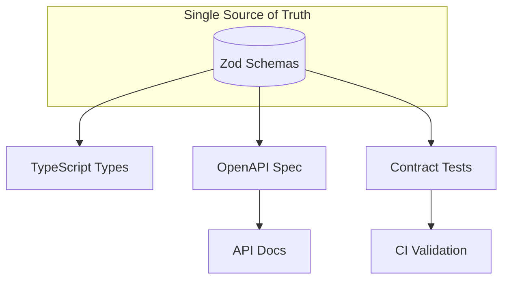

# Typed Collection Template

A type-safe API testing starter with [t-req](https://t-req.io) and [Zod](https://zod.dev).

**Ship Types, Not Docs** — Portable .http files + Zod schemas + t-req = type-safe API testing without complex tooling.

Inspired by [shiptypes.com](https://shiptypes.com).

## What's Included

- **Zod Schemas** — Single source of truth for types, validation, and docs
- **HTTP Collection** — Portable `.http` files organized by resource (auth, users, posts)
- **Contract Tests** — Bun tests that validate API responses against schemas
- **OpenAPI Generation** — Auto-generate `openapi.yaml` from your Zod schemas
- **CI Pipeline** — GitHub Actions with typecheck, tests, and OpenAPI drift detection
- **Workflows** — Multi-step orchestration examples (login → create post)
- **AI Agent Configs** — Pre-configured agents for Claude Code and OpenCode



## Quick Start

```bash
# Install dependencies
bun install

# Validate contracts against live APIs
bun test

# Generate OpenAPI docs from schemas
bun run openapi

# Run example
bun run.ts

# Run workflow
bun workflows/create-post-flow.ts
```

## The Pattern

Instead of loose type assertions:

```typescript
// Before: hope the types are right
const user = await response.json() as { id: number; name: string };
```

Use Zod schemas as the source of truth:

```typescript
// After: validated + typed
import { User } from './schemas';
const user = User.parse(await response.json());
```

Benefits:
- **Runtime validation** - Fails fast when API response changes
- **Type inference** - No manual type definitions needed
- **Single source of truth** - Schema IS the documentation
- **Reusable** - Import schemas anywhere in your codebase

## Your Tests Are Your Contracts

In this starter kit, **tests validate schemas against live APIs**. There's no need for a separate contract testing framework — your test suite IS your contract validation layer.

```typescript
import { User } from '../schemas';

test('returns user matching schema', async () => {
  const response = await client.run('./collection/users/get.http');

  // Schema validation = contract test
  // If the API changes, this throws immediately
  const user = User.parse(await response.json());

  expect(user.id).toBe(1);
});
```

When CI runs your tests:
- Schemas are validated against real API responses
- Breaking changes are caught automatically
- No drift between types and reality

## CI Pipeline

This project includes a GitHub Actions workflow that:

1. **Type checks** — Ensures TypeScript compiles cleanly
2. **Runs tests** — Validates schemas against live APIs
3. **Drift detection** — Fails if OpenAPI spec is out of sync

### OpenAPI Drift Detection

The CI pipeline regenerates the OpenAPI spec and compares it to the committed version. If they differ, the build fails:

```
ERROR: OpenAPI spec out of sync! Run 'bun run openapi' and commit.
```

**To fix:** Run `bun run openapi` locally, review the changes, and commit.

This ensures your documentation always matches your schemas — no more stale API docs.

## Project Structure

```
├── collection/          # HTTP requests (standard .http files)
│   ├── auth/
│   ├── users/
│   └── posts/
├── schemas/             # Zod schemas (source of truth)
│   ├── index.ts
│   ├── auth.ts
│   ├── user.ts
│   └── post.ts
├── workflows/           # Multi-step orchestration examples
├── tests/               # Tests with schema validation
├── client.ts            # Shared t-req client
└── treq.jsonc           # t-req configuration
```

## AI-Assisted Development

This project includes agent configurations for AI-assisted development.

### Using the t-req Agent

The `treq` agent understands the project's patterns and can help you:
- Create new HTTP collection files
- Write Zod schemas with proper validation
- Generate tests with schema validation
- Build multi-step workflows
- Update OpenAPI documentation

### Agent Locations

- **Claude Code:** `.claude/agents/treq.md`
- **OpenCode:** `.opencode/agents/treq.md`

## Writing Schemas

Define your API contracts in `schemas/`:

```typescript
// schemas/user.ts
import { z } from 'zod';

export const User = z.object({
  id: z.number(),
  name: z.string(),
  email: z.string().email(),
});

export type User = z.infer<typeof User>;
```

## Using in Tests

```typescript
import { User } from '../schemas';

test('returns user matching schema', async () => {
  const response = await client.run('./collection/users/get.http');

  // This line does three things:
  // 1. Parses the JSON
  // 2. Validates against schema (throws if invalid)
  // 3. Returns typed result
  const user = User.parse(await response.json());

  expect(user.id).toBe(1);
});
```

## Using in Workflows

```typescript
import { LoginResponse, Post } from './schemas';

// Login - response is typed as LoginResponse
const loginResult = LoginResponse.parse(await loginResponse.json());
client.setVariable('token', loginResult.accessToken);

// Create post - response is typed as Post
const post = Post.parse(await createResponse.json());
console.log(`Created: ${post.title}`);
```

## When Schema Validation Fails

If the API response doesn't match the schema, you get a clear error:

```
ZodError: [
  {
    "code": "invalid_type",
    "expected": "string",
    "received": "undefined",
    "path": ["email"],
    "message": "Required"
  }
]
```

This tells you exactly what field is wrong and why — much better than a cryptic runtime error later.

## Extending This Pattern

### Add New Endpoints

1. Create `.http` file in `collection/`
2. Add schema in `schemas/`
3. Export from `schemas/index.ts`
4. Add tests in `tests/`

### Request Validation

You can also validate request bodies before sending:

```typescript
import { CreatePostRequest } from './schemas';

const body = { title: 'Hello', body: 'World', userId: 1 };

// Validate before sending
CreatePostRequest.parse(body);

const response = await client.run('./collection/posts/create.http', {
  variables: body,
});
```

### Safe Parsing

Use `.safeParse()` when you want to handle invalid data gracefully:

```typescript
const result = User.safeParse(data);

if (result.success) {
  console.log(result.data.name);
} else {
  console.error('Invalid user:', result.error.issues);
}
```

## Why This Matters

> "Types are the contract between services, docs are not."

When your schemas live alongside your requests:
- **No drift** - Schema changes are visible in code review
- **Team alignment** - Everyone uses the same types
- **CI protection** - Tests fail when contracts break
- **Self-documenting** - Schema IS the documentation

## OpenAPI Generation

Your Zod schemas are the single source of truth for both runtime validation AND API documentation.

### Generate OpenAPI Spec

```bash
# Generate openapi.yaml and openapi.json
bun run openapi

# Preview in browser with Redocly
bun run openapi:preview
```

### How It Works

The `openapi/` directory extends your schemas with OpenAPI metadata:

```
openapi/
├── config.ts      # OpenAPI document metadata & registry singleton
├── registry.ts    # Schema registration with descriptions/examples
├── routes.ts      # API endpoint definitions
└── index.ts       # Generation script
```

Your original schemas in `schemas/` remain unchanged — the OpenAPI layer wraps them with additional metadata for documentation purposes.

### The Pattern

1. **Schemas are truth** - Zod schemas define your API contracts
2. **Types are inferred** - TypeScript types derived from schemas
3. **Docs are generated** - OpenAPI spec produced from the same schemas
4. **No drift** - Change the schema, everything updates

## Learn More

- [t-req Documentation](https://t-req.io)
- [Zod Documentation](https://zod.dev)
- [zod-to-openapi](https://github.com/asteasolutions/zod-to-openapi)
- [Ship Types, Not Docs](https://shiptypes.com)
